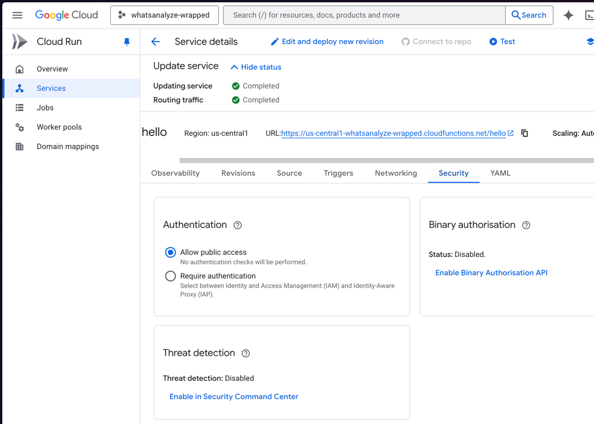

# Project switching
firebase use dev
firebase use prod
# Firebase Functions Setup (Node 22)

## Prerequisites

- Node 22 or higher
- Firebase CLI: `npm install -g firebase-tools`
- both are installed already with nix
- install stripe cli

## Quick Start

### 1. Install Dependencies

```bash
cd functions
npm install
```

### 2. Add Firebase Projects

```bash
firebase use --add
# Alias: dev
# Project: whatsanalyze-dev (or your dev project ID)

firebase use --add
# Alias: prod
# Project: whatsanalyze-prod (or your prod project ID)
```

### 3. Build & Test Locally

```bash
npm run build      # Compile TypeScript
npm run dev        # Run emulator with functions
```

Visit `http://localhost:5001` for emulator UI.

### 4. Deploy to Dev

```bash
firebase use dev
npm run deploy:dev
```

### 5. Deploy to Prod

```bash
firebase use prod
npm run deploy:prod
```

## Available Commands

- `npm run build` — Compile TypeScript → `lib/`
- `npm run serve` — Run emulator
- `npm run dev` — Build + run emulator
- `npm run deploy:dev` — Deploy to dev project
- `npm run deploy:prod` — Deploy to prod project

## Project Structure

```
functions/
├── src/
│   ├── index.ts           # Main functions (hello, helloHttp)
│   ├── appCheck.ts        # Callable verification helper
│   └── appCheckHttp.ts    # HTTPS verification helper
├── lib/                   # Compiled output (generated)
├── package.json
├── tsconfig.json
└── .gitignore
```

## Node Version

Functions target **Node 22** (latest LTS supported by Firebase Functions runtime).

## App Check

App Check is **skipped in emulator** (`FUNCTIONS_EMULATOR === "true"`).

For production:
- Callable functions: Validate `context.app?.token?.valid`
- HTTPS functions: Read & verify `X-Firebase-AppCheck` header via `admin.appCheck().verifyToken()`


## Secrets (Prod Only)

```bash
firebase functions:secrets:set RECAPTCHA_V3_SITE_KEY --project prod
```

Access in functions via `params.RECAPTCHA_V3_SITE_KEY.value()` (for v2 functions syntax).

# Troubleshooting

If you get cors issues when trying to invoke the firebase Callable Cloud Function the most likely issue is that
anonymous access is not allow and needs ot be enabled in gcp.



# Stripe Firebase Functions

Firebase Cloud Functions for handling Stripe checkout and subscriptions, translated from the [Stripe checkout-single-subscription sample](https://github.com/stripe-samples/checkout-single-subscription).

## Quick Start

### 1. Stripe Local testing
- stripe login
- stripe listen --forward-to http://127.0.0.1:5001/whatsanalyze-wrapped/us-central1/stripeWebhook
  - add "Your webhook signing secret is `whsec_2f7....`" output to `.secret.local` file
    - `STRIPE_WEBHOOK_SECRET=`whsec_2f7....``
- stripe trigger checkout.session.completed

### 2. Stripe dev testing
- setup-stripe.sh to set the stripe keys (secret + api)